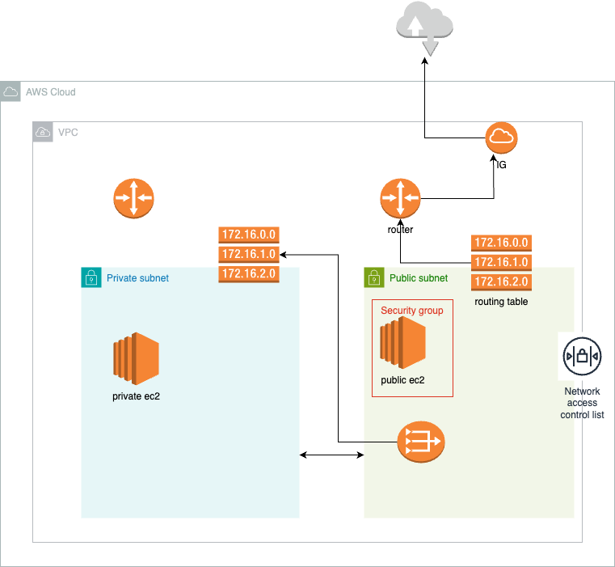

# 🚀 3-Tier Web Application Deployment on AWS using Terraform & Jenkins CI/CD

This project automates the provisioning of a highly available **3-tier architecture** (Web, App, DB) on **Amazon Web Services (AWS)** using **Terraform** for Infrastructure as Code (IaC) and **Jenkins** for continuous integration and deployment (CI/CD).

---

## 📌 Architecture Overview



### Layers:
- **Web Layer**: Public subnet with EC2 instances behind an Internet Gateway.
- **App Layer**: Private subnet hosting application EC2s.
- **DB Layer**: Private subnet hosting an RDS MySQL database.

---

## ⚙️ Technologies Used

| Layer         | Tools/Services                         |
|---------------|----------------------------------------|
| IaC           | Terraform                              |
| CI/CD         | Jenkins                                |
| Cloud         | AWS (EC2, VPC, RDS, Subnets, IGW, etc) |
| Version Control | Git & GitHub                         |

---

## 📁 Project Structure

```text
.
├── Jenkinsfile                 # CI/CD pipeline definition
├── main.tf                    # Terraform entry point
├── providers.tf               # AWS provider configuration
├── variables.tf               # Input variable declarations
├── output.tf                  # Output definitions
├── network.tf                 # VPC, subnets, internet gateway, etc.
├── ec2.tf                     # EC2 instance provisioning
├── rds.tf                     # RDS MySQL setup
├── data.tf                    # Data sources (e.g., AMI lookup)
├── local.tf                   # Local values
├── aws-architecture-diagram.png

🛠️ Setup Instructions
✅ Prerequisites

    AWS CLI configured (aws configure)

    Terraform installed (v1.3+)

    Jenkins running (can be local or on EC2)

    Git & GitHub repo for storing code

🚀 Deploy Infrastructure
```
Initialize Terraform
terraform init

Format & Validate
terraform fmt
terraform validate

Preview changes
terraform plan -out=tfplan

Apply the infrastructure
terraform apply tfplan
```

🔄 CI/CD Pipeline with Jenkins
Jenkinsfile Workflow:

    Clone Repo – Pulls latest Terraform code from GitHub.

    Terraform Init – Initializes backend.

    Terraform Validate – Checks syntax and config.

    Terraform Plan – Shows proposed changes.

    Terraform Apply – Applies infrastructure (manual approval optional).

📤 Outputs

Once deployed, Terraform provides outputs such as:

    Public IP of Web Tier

    RDS Endpoint

    VPC ID

🔒 Security Best Practices

    Resources use least privilege IAM roles.

    All infrastructure is deployed in isolated VPCs.

    RDS instance is not exposed to the internet.

    Use of tags for cost management and resource tracking.

🙌 Contributing

Feel free to fork, improve and submit a pull request. Suggestions for improvement or optimization are welcome.
📄 License

This project is licensed under the MIT License.


